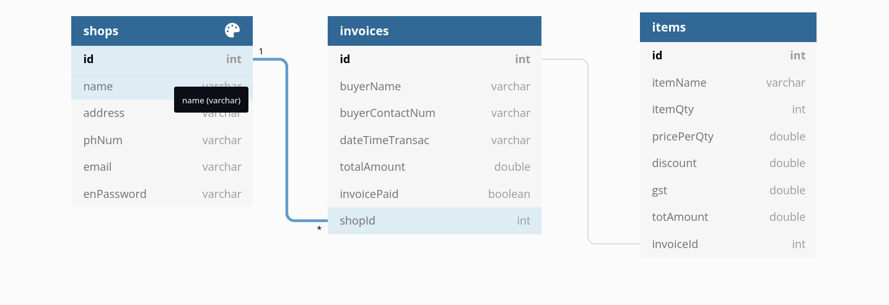

# GraphQL API

This is a simple graphql api created for shopkeepers to store invoice details.

## Technology used

    * NodeJS/Express
    * Docker
    * JWT(for authentication)
    * Graphql
    * MySQL database and sequelize as the ORM library.
    * Sendgrid email API to send emails.

## Project startup

    To start the project, 
    1. Clone the repo 
    2. Open a terminal 
    3. Install docker
    4. Run "docker-compose up".

## Schema for the database

## Documentation

    The api has 3 endpoints 
        1. /shop
        2. /invoice
        3. /resetPassword

### /shop

#### Query:
    1. getShopDetails

        Usage:
            This query fetches details about the stored stop in the database
        
        Syntax:
            getShop(getShopInput: {
                email: String,
                token: String
            }) 

            Return Data format:
                {
                    message: query was successful or not
                    shopId: ID of the shop
                    name: Name of the shop
                    address: Address of the shop
                    phNum: Phone no of the shop
                    email: Email of the shop
                    status: Status code of the request
                }

    
    2. getToken
        Usage:
            This query generates and fetches a web token for the shop owner to authenticate 
            their requests.
        
        Syntax:
            getToken(getTokenInput: {
                email: String,
                password: String
            })
        
            Return Data format:
                {
                    message: query was successful or not
                    shopId: ID of the shop
                    name: Name of the shop
                    address: Address of the shop
                    phNum: Phone no of the shop
                    email: Email of the shop
                    token: Generated token for authenticating
                    status: Status code of the request
                }

#### Mutation:
    1. postRegisterShop

    Usage:
        Register a shop in the database

    Syntax:
        postRegisterShop(shopInput: {
            name: String
            address: String
            phNum: String
            email: String
            password: String
        })

        Return Data format:
            {
                message: mutation was successful or not
                shopId: ID of the shop
                name: Name of the shop
                address: Address of the shop
                phNum: Phone no of the shop
                email: Email of the shop
                status: Status code of the request
            }

    2. deleteShop

    Usage:
        Delete a shop from the database

    Syntax:
        deleteShop(shopDeleteInput: {
            email: String
            password: String
        })

        Return Data format:
            {
                message:  mutation was successful or not
            }

### /invoice

#### Query:
    1. getAllInvoices
        Usage:
            Get all invoices associated with the shop
        Syntax:
            getInvoice(getAllInvoicesInput: {
                email: String
                token: String

            }) 

            Return Data format:
                {
                    message: query was successful or not
                    invoices: array of all the invoices with the items attached
                    status: status code of the query
                }
    
    2. getInvoice
        Usage:
            Get invoice details associated with the invoiceId
        Syntax:
            getInvoice(getInvoiceInput: {
                invoiceId: String
                token: String
            })

            Return Data format:
                {
                    message: query was successful or not
                    buyerName: name of the buyer on the invoice
                    buyerContactNumber: contact num of the invoice
                    dateTimeTransac: date and time of the transaction(result will be in ISO format,
                                                                        Date().toISOString())
                    totalAmount: totalAmount of the invoice
                    invoicePaid: invoice paid or not
                    items: list of all the items
                    shopId: shop id associated with the invoice
                    status: status code of the query
                }

#### Mutation:
    1. postInvoice
    
    Usage:
        Store an invoice on the database
    Syntax:
        postInvoice(postInvoiceInput: {
            shopId: Int
            buyerName: String
            buyerContactNum: String
            dateTimeTransac: String (in ISOString format, Date().toISOString())
            totalAmount: Float
            invoicePaid: Boolean
            items: [ itemName: String
                    itemQty: Int
                    pricePerQty: Float
                    discount: Float
                    gst: Float
                    totAmount: Float
            ]
            token: String
        })

        Return Data format:
            {
                message: mutation was successful or not
                buyerName: name of the buyer on the invoice
                buyerContactNumber: contact num of the invoice
                dateTimeTransac: date and time of the transaction(result will be in ISO format,
                                                                        Date().toISOString())
                totalAmount: totalAmount of the invoice
                invoicePaid: invoice paid or not
                shopId: shop id associated with the invoice
                status: status code of the mutation
            }

    2. deleteInvoice

    Usage: 
        Delete an invoice from the database
    Syntax:
        deleteInvoice(deleteInvoiceInput: {
            invoiceId: Int
            token: String
        })

        Return Data format:
            {
                message: String (mutation was successful or not)
                status: status code of the mutation
            }

    3. updateInvoice

    Usage:
        Update an invoice whether invoice was paid or not
    Syntax:
        updateInvoice(updateInvoiceInput: {
            invoiceId: String
            token: String
            invoicePaid: Boolean
        })

        Return Data format:
            {
                message: mutation was successful or not
                status: status code of the mutation
            }
    
    4. deleteAllInvoices

    Usage:
        Delete all invoices associated with the shop
    Syntax:
        deleteAllInvoices(deleteAllInvoicesInput: {
            email: String
            token: String
        })

        Return Data format:
            {
                message: mutation was successful or not
                status: status code of the mutation
            }

### /resetPassword

#### Query:

    1. getTokenResetPassword

        Usage: 
            get token to reset password on the registered email

        Syntax: 
            getTokenResetPassword(getTokenResetPasswordInput: {
                email: String
            })
        
            Return data format: {
                message: query was successful or not
                status: status code of the query
            }

#### Mutation:

    1. postResetPassword

        Usage:
            Use the token to reset password
        
        Syntax:
            postResetPassword(postResetPasswordInput: {
                email: String
                newPassword: String
                token: String
            })

            Return data format: {
                message: mutation was successful or not
                status: status code of the mutation
            }

